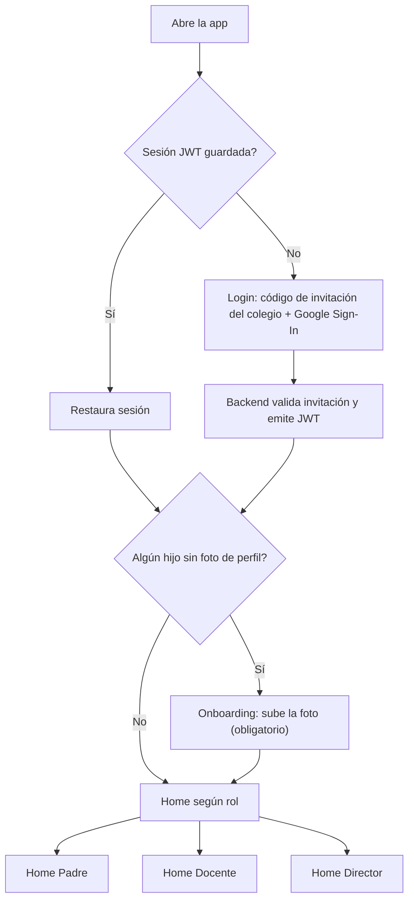
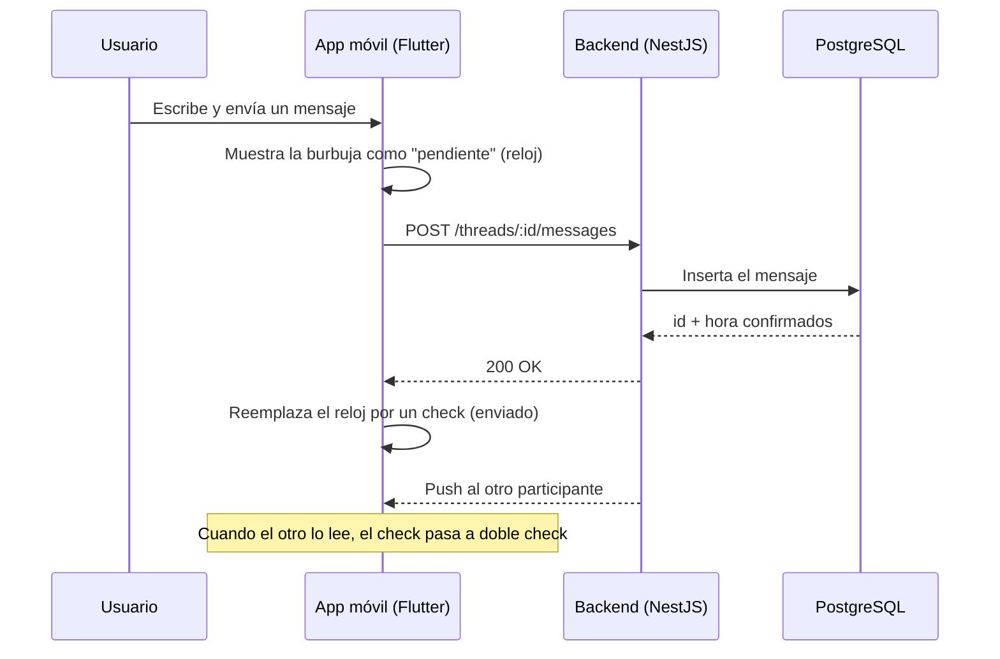
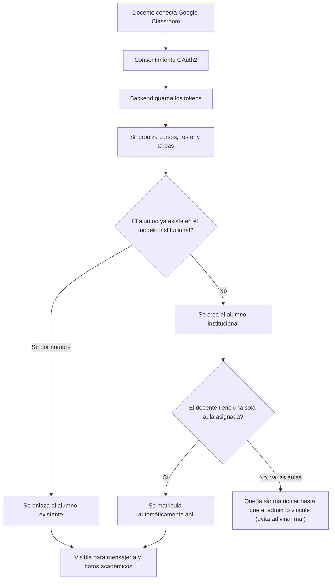
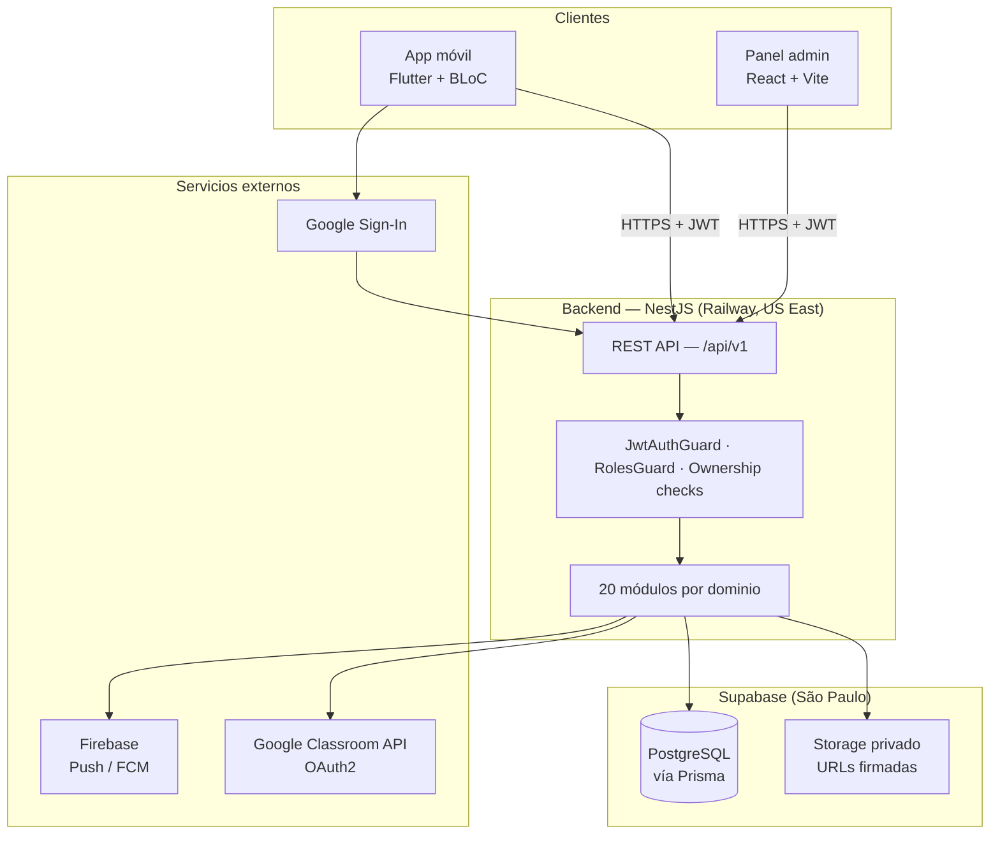

# KOLEXA

> Plataforma de comunicación y gestión escolar (Perú) que conecta a padres, docentes y dirección en un solo sistema — con permisos por rol y por colegio, integración real con Google Classroom, y persistencia offline-first en mobile.

---

## 🎯 El problema

En la mayoría de colegios peruanos, la comunicación y la gestión operativa del día a día están repartidas entre herramientas que no se hablan entre sí: grupos de WhatsApp sin control de quién puede escribirle a quién, asistencia y notas en Excel o papel, autorización de recojo de alumnos manejada de palabra en portería, pagos sin seguimiento centralizado, y comunicados que se pierden en el ruido de un chat grupal.

Esto genera problemas concretos:

- **Sin trazabilidad ni permisos**: cualquiera en un grupo de WhatsApp puede ver o escribirle a cualquiera, sin que exista una relación real (¿este padre es en verdad el apoderado de este alumno? ¿este docente enseña en esta aula?).
- **Información fragmentada**: un director no tiene una vista consolidada de asistencia, tareas o pagos de su colegio; un padre tiene que revisar 3-4 canales distintos para enterarse de todo lo relacionado a su hijo.
- **Adopción parcial de Google Classroom**: muchos colegios ya usan Classroom para tareas, pero Classroom no resuelve asistencia, pagos, recojo autorizado, ni una mensajería 1:1 validada por relación padre-alumno-docente.
- **Recojo y autorización sin registro**: quién puede recoger a un alumno suele manejarse de memoria o en un cuaderno físico.

KOLEXA no compite con Google Classroom — lo integra como una fuente más dentro de un modelo institucional propio, y cubre todo lo que Classroom no resuelve.

## 💡 La solución

KOLEXA es una plataforma multi-colegio (multi-tenant) con tres superficies que comparten un mismo backend y un mismo modelo de datos:

- **App móvil** (Flutter) para padres y docentes: mensajería, asistencia, tareas, notas, pagos, recojo, citas, comunicados, Google Classroom.
- **Panel web administrativo** (React) para el colegio: alta de usuarios/alumnos/aulas, importación masiva, vinculación padre-alumno, importación de horario.
- **API REST** (NestJS + PostgreSQL) que expone todo lo anterior con autorización por rol y por colegio, para que ningún dato cruce entre colegios ni entre usuarios sin relación real.

Cada colegio es un tenant aislado: los datos, las aulas, los usuarios y los mensajes de un colegio nunca son visibles para otro.

## 👥 Usuarios y roles

| Rol | Qué puede hacer |
|---|---|
| **Padre / Apoderado** | Ver a sus hijos (vinculados explícitamente por el colegio, nunca por auto-registro), su asistencia, tareas, notas y pagos; mensajear con los docentes y la dirección de sus hijos; autorizar quién los recoge; agendar citas con el docente. |
| **Docente** | Gestionar sus aulas asignadas: pasar asistencia, publicar tareas y anécdotas, mensajear con los padres de sus alumnos, conectar su cuenta de Google Classroom y sincronizar cursos/tareas/roster. |
| **Director / School admin** | Alta y gestión de usuarios, alumnos y aulas del colegio; importación masiva; vinculación padre-alumno; **lectura** (nunca escritura en nombre de otros) de toda la actividad operativa del colegio — asistencia, tareas, notas, pagos, anécdotas, citas — de cualquier aula propia. |

## ✨ Funcionalidades principales

**Comunicación**
- Mensajería 1:1 validada por relación real (padre↔docente↔dirección), con historial offline, indicador de "en línea", envío optimista estilo WhatsApp (reloj → check → doble check) y menciones `@` que adjuntan una tarea directamente al mensaje.
- Comunicados del colegio/aula (broadcast) con confirmación de lectura.
- Notificaciones push para cada uno de los módulos anteriores.

**Gestión académica**
- Asistencia diaria por alumno.
- Tareas — institucionales y sincronizadas desde Google Classroom, mostradas de forma unificada al padre.
- Notas por periodo académico.
- Anécdotas: observaciones puntuales del docente sobre un alumno.

**Operación escolar**
- Pagos escolares (matrícula, pensiones) con seguimiento de obligaciones por alumno.
- Recojo autorizado: quién puede recoger a cada alumno, con registro de cada evento de recojo.
- Citas padre-docente con slots de horario.
- Buzón de sugerencias con respuesta del colegio, y una cuponera de descuentos con socios comerciales.

**Integración con Google Classroom**
- El docente conecta su cuenta de Google; KOLEXA sincroniza cursos, roster y tareas, y resuelve automáticamente qué alumno de Classroom corresponde a qué alumno institucional — incluyendo altas automáticas de alumnos que son nuevos en Classroom (ver [Desafíos técnicos](#-desafíos-técnicos)).

**Panel administrativo**
- Importación masiva de alumnos/padres/aulas desde CSV/Excel, con vista previa y confirmación antes de escribir en la base.
- Importación de horario de aula a partir de una foto (IA + revisión humana antes de confirmar).

## 🔄 Flujos principales

**Autenticación y onboarding**

**Mensajería con envío optimista**

**Sincronización con Google Classroom**

## 🏗️ Arquitectura

Una decisión de arquitectura que atraviesa todo el backend: el **modelo institucional** (`Student`, `Classroom`, `StudentEnrollment`) es la única fuente de verdad. Las tablas `gc_*` (roster y cursos de Google Classroom) son un caché desechable, conectado al modelo propio solo a través de una tabla puente (`GcCourseLink`). Google Classroom **alimenta** el modelo institucional; nunca lo reemplaza — así la plataforma no queda atada a la disponibilidad ni a la estructura de datos de un proveedor externo.

## 📱 Aplicación móvil

- **Flutter + BLoC** (`flutter_bloc`), organizado feature-first bajo `lib/features/<feature>/` (17 features: auth, home, threads, attendance, homework, grades, payments, pickup, appointments, announcements, anecdotes, suggestions, coupons, classroom, teachers, notifications, onboarding).
- **Navegación**: `go_router` con un único `redirect` centralizado, dirigido por el estado de `AuthBloc` (vía un adaptador `Stream → ChangeNotifier`) — toda la lógica de rutas protegidas vive en un solo lugar, no repartida por pantalla.
- **Red**: `Dio` + un interceptor de autenticación que inyecta el JWT en cada request y, ante un 401, refresca el token y reintenta la petición original en silencio — clasificando el error por un código de máquina (no por texto del mensaje), para no confundir un token de Google Classroom vencido con una sesión de KOLEXA vencida.
- **Persistencia**: `TokenStore` centraliza el access/refresh token como única fuente de verdad. Para mensajería, `Drift` (capa type-safe sobre SQLite) implementa un patrón **offline-first**: la UI lee primero del disco (instantáneo, incluso recién abierta la app) y el backend se consulta en segundo plano para traer lo nuevo — igual que WhatsApp. Cada cuenta tiene su propia base de datos local, para que cambiar de cuenta en un dispositivo compartido nunca filtre datos de la cuenta anterior.
- **Autenticación**: Google Sign-In + código de invitación del colegio. Los tokens JWT se guardan en `SharedPreferences` (no en `flutter_secure_storage`) por una decisión de rendimiento explícita — ver [Decisiones técnicas](#-decisiones-técnicas). `android:allowBackup="false"` evita que el backup automático de Android reviva una sesión ya cerrada al reinstalar la app.
- **Notificaciones**: Firebase Cloud Messaging + notificaciones locales; tocar una notificación navega directo a la pantalla correspondiente (ej. el hilo exacto) con el contenido pre-cargado en caché local para que no aparezca en blanco.
- **Testing**: 9 archivos de test enfocados (sin contar el placeholder por defecto de Flutter) — interceptor de auth, almacén de tokens, un test específico de que los tokens nunca se filtran a los logs, aislamiento de la base local por cuenta, esquema de Drift, seguridad de escritura en SQLite y guardas contra estados obsoletos (`staleness guard`).

## 🖥️ Panel administrativo

- **React 18 + TypeScript + Vite**, con TanStack Query (estado de servidor) y TanStack Table, formularios con React Hook Form + validación Zod, componentes Radix UI y Tailwind CSS.
- **Páginas**: dashboard, alumnos, padres (vinculación padre-alumno), aulas (matrícula), cursos, horarios, usuarios, institución, importación masiva (CSV/Excel con `papaparse`/`xlsx`) e importación/vinculación de cursos de Google Classroom.
- Habla con el **mismo backend REST** que la app móvil, bajo los mismos guards y reglas de rol (exclusivo para `school_admin`) — no hay una API paralela para el panel.

## ⚙️ Backend

- **NestJS**, organizado como un monolito modular: 20 módulos agrupados por fase de producto (documentado así en el propio `app.module.ts`) — base (auth) → comunicación diaria (asistencia, tareas, comunicados, mensajería) → gestión académica y pagos (notas, citas, recojo, pagos) → funciones complementarias (anécdotas, sugerencias, cupones) → integraciones (Classroom, docentes) → onboarding (invitaciones) → notificaciones → administración (import, horario).
- **Seguridad transversal**: `JwtAuthGuard` como guard global (toda ruta requiere JWT salvo que esté marcada `@Public()`), `RolesGuard` + decorador `@Roles()`, límite de tasa global (`ThrottlerGuard`, 300 req/min por defecto) con límites más estrictos en endpoints sensibles (login, refresh, invitaciones).
- **Validación global**: `ValidationPipe` con `whitelist` + `forbidNonWhitelisted` + `transform` — los DTOs son listas blancas estrictas, cualquier campo no declarado se rechaza con 400 antes de llegar al controlador.
- **Manejo de errores**: un `HttpExceptionFilter` global normaliza toda respuesta de error a un mismo formato.
- **Detalles de infraestructura resueltos explícitamente**: serialización de `BigInt` (Prisma devuelve `BigInt` para las PK de Postgres, que `JSON.stringify` no soporta por defecto) y `trust proxy` habilitado para que el rate limiting calcule la IP real del cliente detrás del proxy de Railway, en vez de limitar a todos los usuarios como si fueran uno solo.
- **Prisma** como capa de datos única: nombres en camelCase en TypeScript, snake_case en Postgres vía `@map`/`@@map`; los borrados son lógicos (`deletedAt`), filtrados explícitamente en cada consulta.

## 🗄️ Base de datos

- **PostgreSQL** (Supabase, São Paulo) vía **Prisma**: 67 modelos, 26 migraciones.
- **Multi-tenant**: `School` → `SchoolLocation` → `Classroom`; el control de acceso se resuelve con `UserRole` (rol + colegio) y `UserClassroom` (rol acotado a una aula específica, como un docente).
- **Modelo institucional**: `Student` y `StudentEnrollment` son la fuente de verdad de quién está matriculado dónde. `UserStudent` es el puente materializado padre↔alumno que usa toda la app para resolver acceso real (mensajería, notas, pagos); `ParentStudent` es el vínculo institucional previo a que el padre tenga cuenta.
- **Caché de Google Classroom separado a propósito**: las tablas `gc_*` (`GcTeacherCourse`, `GcCourseStudent`, `GcCoursework`, etc.) nunca se mezclan con el modelo institucional — se conectan únicamente vía `GcCourseLink` (id de curso de Google ↔ curso institucional).
- **Política explícita de no-borrado físico** en mensajería: el esquema documenta que un colegio puede necesitar mostrar qué se dijo — los mensajes se borran de forma lógica (`deletedAt`), nunca con un `DELETE` físico.

## 🔐 Seguridad

- **JWT de acceso (1h) + refresco (7 días)**, firmados con secretos separados. El refresh token se persiste en base de datos para poder revocarlo explícitamente en el logout — corrigiendo un hallazgo real de una auditoría interna (el logout no tocaba la tabla de tokens, así que un refresh token seguía siendo válido hasta 7 días después de "cerrar sesión").
- **Revocación efectiva**: tanto la validación de cada request como el endpoint de refresh verifican que el usuario siga activo y no eliminado — otro hallazgo corregido (antes, un usuario desactivado con su refresh token robado podía seguir generando access tokens nuevos).
- **Autorización por rol y por colegio**: `RolesGuard` + utilidades de ownership (`isSchoolAdminOf`) acotan cada lectura/escritura al colegio del usuario autenticado. Esto se validó contra una auditoría interna con hallazgos numerados (IDOR entre colegios/alumnos vía IDs controlados por el cliente), cada uno respaldado por un **test de integración contra una instancia real de Postgres**, no mocks.
- **Excepción de lectura para el director**: un `school_admin` puede leer cualquier alumno/aula de su propio colegio (nunca escribir en nombre de otro), con tests dedicados a verificar que esa excepción no filtra hacia otros colegios.
- **Condiciones de carrera resueltas y probadas**: el vínculo padre-alumno y la redención de invitaciones son operaciones idempotentes bajo concurrencia real, verificadas con suites de test que disparan peticiones simultáneas contra Postgres en vez de asumir un orden de ejecución.
- **Almacenamiento de fotos en buckets privados** (Supabase Storage): la base de datos guarda solo la ruta del archivo, nunca una URL pública; la URL servible se firma bajo demanda con vigencia corta.
- **En mobile**: los tokens en `SharedPreferences` son una decisión de rendimiento documentada, no un descuido (ver más abajo); `allowBackup="false"` para que el backup automático de Android no reviva una sesión cerrada.

No se afirma que el sistema sea invulnerable — la aproximación fue auditar puntos concretos de riesgo (IDOR, revocación de sesión, condiciones de carrera) y dejar cada corrección respaldada por un test de regresión.

## 🧪 Testing

**Backend (Jest)**
- **233 tests unitarios** en 19 suites, con mocks de Prisma hechos a mano (sin base de datos real) — cubren servicios, guards y casos límite de cada módulo.
- **8 suites de integración + 2 de concurrencia** (83 casos en total) que corren contra una instancia **real** de Postgres local — con un guard (`assertLocalTestDatabase()`) que se niega a ejecutar si la conexión no es explícitamente una base de test, para no arriesgar producción. Están enfocadas en IDOR entre colegios, revocación de sesión y condiciones de carrera reales.

**Mobile**
- 9 tests dirigidos (no una suite exhaustiva): interceptor de autenticación, almacén de tokens, que los tokens nunca lleguen a los logs, aislamiento de la base de datos local por cuenta, esquema de Drift, seguridad de escritura concurrente en SQLite.

No hay una suite de end-to-end/UI automatizada — los cambios de interfaz se verifican con pruebas en vivo sobre dispositivos y emuladores reales antes de publicarse.

## 🔔 Notificaciones y comunicación

- **Firebase Admin SDK** (backend) + **Firebase Cloud Messaging** (mobile) para push en todos los módulos (mensajes, tareas, asistencia, comunicados, etc.), con resincronización automática del token FCM tanto al abrir la app como ante una rotación real de Firebase.
- Tocar una notificación navega directo a la pantalla correspondiente con el contenido pre-cargado, para que no aparezca vacía mientras la red responde.
- La mensajería no usa websockets: sincroniza vía push + refresco de la caché local en Drift — una decisión deliberada para un producto mobile-first con conectividad intermitente (ver [Decisiones técnicas](#-decisiones-técnicas)).

## 🔗 Integraciones

| Integración | Qué resuelve |
|---|---|
| **Google Classroom API** (OAuth2) | Sincroniza cursos, roster y tareas del docente/alumno, con scopes separados para cada flujo. |
| **Google Sign-In** | Autenticación principal de la app, junto con el código de invitación del colegio. |
| **Firebase** (Admin SDK + FCM) | Notificaciones push de todos los módulos. |
| **Supabase** | PostgreSQL administrado + almacenamiento de objetos privado (fotos, con URLs firmadas). |
| **Railway** | Hosting del backend, con deploy automático desde `main`. |

## ⚡ Rendimiento

El backend corre en Railway (US East) y la base de datos en Supabase (São Paulo) — cada viaje a la base cuesta entre 350 y 400 ms solo de latencia de red cruzando región. Esto llevó a decisiones concretas, no solo teóricas:

- **Fusión de queries secuenciales**: el endpoint de bandeja de mensajes (`/inbox`) pasó de ~1.2s (caché caliente) / ~4s (fría) a ~1.0s / ~3s al fusionar dos consultas secuenciales en una sola, medido en producción.
- **Desnormalización deliberada**: el rol y el colegio del usuario viajan dentro del JWT, para que la estrategia de autenticación no necesite un `JOIN` en cada request autenticado.
- **Caché en memoria de 30 segundos** para "¿este usuario sigue activo?" en la validación del JWT — evita una consulta a la base en el camino más caliente de toda la app (se ejecuta en cada request autenticado), con un costo de seguridad acotado y documentado (revocación con hasta 30s de retraso en el peor caso).
- **Escrituras en lote**: la sincronización de Google Classroom usa `INSERT ... ON CONFLICT` en lote en vez de un upsert por fila, para no convertir el roster de un aula en decenas de escrituras individuales.

## 🧠 Decisiones técnicas

- **Flutter** para mobile: un único código Dart para Android e iOS, adecuado para la etapa del producto donde mantener dos apps nativas por separado no se justifica.
- **NestJS como monolito modular** (no microservicios): en la implementación se optó por 20 módulos con límites claros dentro de un solo servicio, priorizando velocidad de desarrollo sobre la complejidad operativa de microservicios en esta etapa.
- **Prisma + PostgreSQL**: el dominio (colegios, aulas, alumnos, matrículas, pagos) es genuinamente relacional — encaja mejor con integridad referencial y transacciones que con un modelo de documentos.
- **JWT de acceso + refresco** en vez de sesiones con cookie: la superficie principal es una API REST consumida por una app móvil, no un navegador, así que JWT evita depender de cookies entre plataformas.
- **Offline-first con Drift/SQLite en mobile**: en la implementación se optó por leer siempre primero del disco local y refrescar en segundo plano, en vez de depender de la red en cada pantalla, dado el patrón real de uso (conectividad intermitente en el entorno escolar).
- **Modelo institucional separado del caché de Google Classroom**: en la implementación se optó por que Classroom alimente el modelo propio en vez de reemplazarlo, para no atar la plataforma a la disponibilidad ni a la estructura de datos de un proveedor externo.
- **`SharedPreferences` en vez de `flutter_secure_storage` para los tokens en mobile**: en la implementación se optó por este tradeoff de rendimiento — inicializar el Keystore de Android tarda 20-30 segundos en gama baja/media con chipset Exynos — dado que los tokens son de vida corta y ya están protegidos por el sandbox de la app.

## 🛠️ Desafíos técnicos

1. **Autorización multi-tenant sin fugas entre colegios.** Se auditaron internamente los puntos donde un ID controlado por el cliente (`studentId`, `parentId`, `obligationId`) podía filtrar datos de otro colegio o alumno, y cada hallazgo quedó respaldado por un test de integración contra Postgres real, no solo un `403` de humo.
2. **Revocación de sesión que funcione de verdad.** El refresh token no se invalidaba en logout, y el endpoint de refresh no verificaba si el usuario seguía activo — ambos corregidos y cubiertos con test de regresión.
3. **Condiciones de carrera en operaciones idempotentes.** El vínculo padre-alumno podía quedar huérfano si el login de Google del padre se completaba en la misma ventana en que un admin creaba el vínculo desde el panel — resuelto releyendo el estado dentro de una transacción en vez de reusar un valor capturado antes.
4. **Reconciliar dos modelos de datos en paralelo**: el roster de Google Classroom y la matrícula institucional. La sincronización crea alumnos institucionales nuevos cuando aparecen primero en Classroom, pero solo los matricula automáticamente si el docente tiene una sola aula asignada — con varias aulas, queda pendiente de que un admin confirme el vínculo, en vez de adivinar la aula incorrecta.
5. **Latencia cross-región** entre el backend y la base de datos, resuelta con fusión de consultas, desnormalización en el JWT y escrituras en lote en vez de una por fila.
6. **Mensajería offline-first con envío optimista** sin que la burbuja "pendiente" desaparezca ni deje un hueco de pantalla de carga mientras el servidor confirma el mensaje real.
7. **Aislamiento de datos por cuenta en un mismo dispositivo**: cada usuario tiene su propia base de datos local, para que cambiar de cuenta en un dispositivo familiar compartido nunca exponga datos de la cuenta anterior.

## 📊 Resultados

Estas son métricas de desarrollo e ingeniería, no de negocio — el producto está en etapa de desarrollo/piloto, sin cifras de usuarios, colegios o ingresos que reportar todavía.

- **233/233 tests unitarios de backend** pasando (19 suites), más 8 suites de integración y 2 de concurrencia contra Postgres real, enfocadas en seguridad y condiciones de carrera.
- **9 tests dedicados en mobile** (aislamiento de cuentas, manejo de tokens, persistencia local).
- **Mejora medida en producción**: el endpoint de bandeja de mensajes bajó de ~1.2s/~4s (caliente/fría) a ~1.0s/~3s al fusionar dos consultas secuenciales.
- **Alcance del dominio**: 67 modelos de datos y 26 migraciones — un reflejo del alcance funcional real del sistema, no una métrica a optimizar por sí misma.

## 🛠️ Stack tecnológico

| Área | Tecnología |
|---|---|
| **Mobile** | Flutter, Dart, flutter_bloc (BLoC), go_router, Drift (SQLite), Dio |
| **Backend** | NestJS, TypeScript, Prisma ORM |
| **Web / Admin** | React 18, TypeScript, Vite, TanStack Query, TanStack Table, React Hook Form, Zod, Radix UI, Tailwind CSS |
| **Database** | PostgreSQL (Supabase) |
| **Authentication** | JWT (access + refresh), Google OAuth2 (Sign-In + Classroom), Passport |
| **Testing** | Jest, ts-jest, mocktail, bloc_test |
| **Cloud / Hosting** | Railway (backend), Supabase (base de datos + storage) |
| **Integraciones** | Google Classroom API, Firebase Admin SDK / FCM |
| **Otras herramientas** | flutter_secure_storage (iOS), image_cropper, papaparse / xlsx (importación masiva) |

## 📸 Screenshots

*(Espacio reservado — agregar capturas reales antes de publicar)*

Pantallas sugeridas, priorizando las que mejor muestran producto y complejidad real:

- Home de Padre, Docente y Director (para mostrar la diferencia de roles).
- Hilo de mensajería con el envío optimista (reloj → check → doble check) y una mención `@` de tarea.
- Pantalla de conexión con Google Classroom y el roster sincronizado.
- Panel administrativo: página de Aulas (matrícula) y de Padres (vinculación padre-alumno).
- Flujo de importación masiva (CSV/Excel) con la vista previa antes de confirmar.

## 🔒 Confidencialidad

Este repositorio y este caso de estudio pueden hacer referencia a datos, nombres o configuraciones de colegios reales. Cualquier captura, dato de ejemplo o export debe anonimizarse antes de publicarse, y las credenciales (Firebase, Google OAuth, base de datos) nunca deben incluirse en el repositorio ni en la documentación pública.
